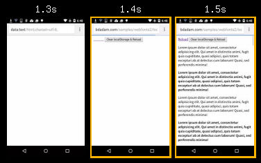
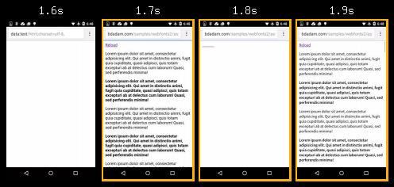

_Вы читаете перевод статьи [Better webfont loading with using localStorage and providing WOFF2 support](http://bdadam.com/blog/better-webfont-loading-with-localstorage-and-woff2.html)_

# Улучшение загрузки веб-шрифтов с использованием localStorage и поддержкой формата WOFF2

В своей [прошлой статье](http://bdadam.com/blog/loading-webfonts-with-high-performance.html)([перевод](http://css-live.ru/articles-css/bystraya-zagruzka-veb-shriftov-na-adaptivnyx-sajtax.html)) я показал метод,  как можно загружать веб-шрифты не блокируя отрисовку страницы и убрать при этом раздражающее пользователей мерцание текста. На этот раз я продемонстрирую оптимизированную версию скрипта и покажу способ подключения WOFF2 для новейших браузеров.

## Задачи
1. Пользователи должны увидеть текст настолько быстро, насколько возможно.
2. Пока шрифт грузится, текст должен быть отрисован запасным шрифтом, чтобы пользователи смогли его увидеть и прочитать.
3. Нельзя раздражать пользователей мерцанием текста при каждой загрузке страницы.
4. Современные браузеры, поддерживающие формат WOFF2, должны получать файлы в WOFF2, размер которых примерно на 30% меньше.

## Как это сделать

* Асинхронная загрузка шрифтов как CSS решает задачи №1 и №2. Но, к сожалению, вызывает мерцание при каждой загрузке страницы. Браузеры уже отрисовали текст запасным шрифтом к тому моменту, когда загрузился веб-шрифт. Поэтому они заменяют тексты, что вызывает некоторое мерцание.


* Идея состоит в том, чтобы загружать шрифт с сервера только один раз. После этого мы сохраняем данные в localStorage, и при последующих запросах мы будем загружать шрифт непосредственно оттуда. Это уберет мерцание при повторных загрузках, оно останется только при первом открытии страницы. Таким образом, задача №3 также решается.

* Довольно сложно распознать поддержку WOFF2 в браузере, если мы не хотим полагаться на распознавание user agent. Лучшее, что я смог найти — очень [продуманный скрипт](https://github.com/filamentgroup/woff2-feature-test) от Filament Group, использующий API загрузки шрифтов. Он не решает задачу на все 100%, однако не дает неправильных результатов,что приемлемо в нашем случае.

## Обзор скрипта

1. Для старых браузеров мы сразу остановим загрузку. Проверки window.addEventListener или некоторых известных user agent (старый Android браузер, Opera Mini и т.п.) будет достаточно.
2. Иногда localStorage может быть недоступно, несмотря ня поддержку браузером WOFF шрифтов. На этот случай я делаю запасной вариант.
3. Затем мы проверяем, был ли шрифт сохранен в localStorage. Если был, загружаем его немедленно.
4. Если шрифт не был загружен ранее, получаем его AJAX запросом. Но перед этим проверяем поддержку WOFF2.
5. Затем сохраняем данные в localStorage и добавляем код css в элемент `<style>`.

## Давайте взглянем на скрипт
```javascript
//Этот скрипт должен быть размещен в HEAD над всеми внешними объявлениями стилей (link[rel=stylesheet])
function loadFont(fontName, woffUrl, woff2Url) {
	// 0. Многие неподдерживаемые браузеры должны останавливать работу тут.
	var nua = navigator.userAgent;
	var noSupport = !window.addEventListener // IE8 и ниже
			|| (nua.match(/(Android (2|3|4.0|4.1|4.2|4.3))|(Opera (Mini|Mobi))/) && !nua.match(/Chrome/)) // Android Stock Browser до 4.4 и Opera Mini

	if (noSupport) { return; }

	// 1. Настраиваем localStorage
	var loSto = {};
	try {
		// Устанавливаем вспомогательную переменную для помощи с localStorage, 
		// например для случаев когда cookies отключены и браузер не дает к ним доступа. 
		// Иначе могут быть получены исключения, 
		// которые полностью остановят загрузку шрифтов.
		loSto = localStorage || {};
	} catch(ex) {}

	var localStoragePrefix = 'x-font-' + fontName;
	var localStorageUrlKey = localStoragePrefix + 'url';
	var localStorageCssKey = localStoragePrefix + 'css';
	var storedFontUrl = loSto[localStorageUrlKey];
	var storedFontCss = loSto[localStorageCssKey];


	// 2. Создаем элемент <style>, который мы используем для вставки шрифта, закодированного в base64.
	var styleElement = document.createElement('style');
	styleElement.rel = 'stylesheet';
	document.head.appendChild(styleElement);
	// Из-за ошибок IE9 установка styleElement.textContent должна быть после этой строки.


	// 3. Проверяем, находится ли шрифт уже в localStorage и последней ли он версии.
	if (storedFontCss && (storedFontUrl === woffUrl || storedFontUrl === woff2Url)) {
		// css до сих пор в localStorage
		// и были загружены из одного из текущих адресов

		// 4. Применяем стили шрифта.
		styleElement.textContent = storedFontCss;
	} else {
		// Данных нет, или они загружены с устаревшего URL,
		// поэтому мы должны загрузить их снова.


		// 5. Проверяем поддержку woff2 чтобы узнать, какой URL использовать.
		var url = (woff2Url && supportsWoff2())
			? woff2Url // WOFF2 URL передан в функцию и поддерживается.
			: woffUrl; // Поддерживается только WOFF.


		// 6. Получаем данные с сервера.
		var request = new XMLHttpRequest();
		request.open('GET', url);
		request.onload = function() {
			if (request.status >= 200 && request.status < 400) {

				// 7. Обновляем localStorage новыми данными и применяем стили шрифта.
				loSto[localStorageUrlKey] = url;
				loSto[localStorageCssKey] = styleElement.textContent = request.responseText;
			}
		};
		request.send();
	}

	function supportsWoff2() {
		// Источник: https://github.com/filamentgroup/woff2-feature-test
		if (!window.FontFace) {
			return false;
		}

		var f = new FontFace('t', 'url("data:application/font-woff2,") format("woff2")', {});
		f.load();

		return f.status === 'loading';
	}
}

```

Скрипт и несколько Grunt задач по минификации доступны по ссылке [Github/bdadam/OptimizedWebfontLoading](https://github.com/bdadam/OptimizedWebfontLoading). Также вы найдете там демо файлы.

## Где разместить скрипт

Скрипт должен находиться в HEAD разделе вашей страницы над всеми объявлениями стилей, так, чтобы это не блокировало отрисовку страницы (браузер не должен ждать, пока CSSOM станет готова).

## Что происходит, когда localStorage недоступно?
Как правило, это случается, когда cookies отключены или сайт загружен внутри WebView контейнера в приложении. В этом случае код по-прежнему работает и откатывается к обычному браузерному кэшированию. CSS файл запрашивается при каждой загрузке страницы, но обрабатывается из браузерного кэша — до тех пор, пока у CSS файла установлены соответствующие заголовки кэша.

## Запасной шрифт
Я считаю, что достаточно подключать веб-шрифты лишь для тех браузеров, которые поддерживают WOFF или WOFF2 форматы. Это примерно для 90% всех пользователей в мире. Другие браузеры должны получать текст, отрисованный запасным шрифтом.

Пользователи со старыми браузерами будут благодарны за то, что мы не тратим их ограниченные ресурсы(ЦПУ, память) на развлекательные нужды.

## Демо
Хотя техника, показанная в этой статье, на сей момент является самым предпочтительным для меня путем загрузки веб-шрифтов, для сравнения я представлю еще 2 техники.

1. [Загрузка веб-шрифтов как CSS(асинхронно), затем размещение в localStorage для последующих запросов.](http://bdadam.com/samples/webfonts2/localStorage.html)
2. [Загрузка веб-шрифтов как CSS(асинхронно), но без использования localStorage](http://bdadam.com/samples/webfonts2/asynccss.html)
3. [Загрузка веб-шрифтов из внешних WOFF и WOFF2 файлов](http://bdadam.com/samples/webfonts2/external-fonts.html)

## Сравнение
Я провел некоторые тесты на [webpagetest.org](http://www.webpagetest.org/) с 3G соединением.

Первое посещение было просто-напросто одинаковым для решений с localStorage и асинхронным CSS. Оба сначала отрисовали текст запасным шрифтом, затем переключились на веб-шрифт, вызвав мерцание в первый раз. Загрузка шрифтов из внешних файлов привела к невидимости текста до тех пор, пока шрифты не были загружены. Это затормозило отрисовку на 0.6 секунд.

№1 и №2 лидируют.

Сравнения от второго посещения также показывает некоторые различия между localStorage и асинхронным CSS. Мы можем ясно видеть, что загрузка из localStorage не вызывает никакой перерисовки. Как только HTML загружен, страница отрисовывается немедленно.

Метод асинхронного CSS отрисовывает страницу с базовым шрифтом, а затем перерисовывает с веб-шрифтом. Это вызывает мерцание для пользователя при каждой загрузке страницы.

C учетом этого, №1 — победитель.

Скриншоты, чтобы показать эти отличия:



*Асинхронная загрузка CSS с использованием localStorage. Нет перерисовки.*
<br>
<br>
<br>



*Асинхронная загрузка CSS без использования localStorage. Видна перерисовка.*
<br>
<br>
<br>


*Внешняя загрузка шрифтов. Отрисовка останавливается, пока шрифты не загрузятся.*
<br>
<br>
<br>

### Материалы

* [My prevoius article about webfont loading on responsive sites](http://bdadam.com/blog/loading-webfonts-with-high-performance.html)
* [Woff2 feature test by Filament Group](https://github.com/filamentgroup/woff2-feature-test)
* [WOFF2 support @ caniuse.com](http://caniuse.com/#feat=woff2)
* [Font loading support @ caniuse.com](http://caniuse.com/#search=FontFace)
* [Web Fonts Performance: Making Pretty, Fast - By Ilya Grigorik](https://www.igvita.com/2012/09/12/web-fonts-performance-making-pretty-fast/)
* [Improving Smashing Magazine’s Performance: A Case Study](http://www.smashingmagazine.com/2014/09/08/improving-smashing-magazine-performance-case-study/)
* [How we make RWD sites load fast as heck](https://www.filamentgroup.com/lab/performance-rwd.html)

## Обновление
Как посоветовал @CrocoDillon, я добавил третий (необязательный) аргумент к `new FontFace(..., ..., {})` при проверке поддержки WOFF2. Иначе некоторые браузеры выдают ошибки (Chrome 35 и 36, Opera 22 и 23). Посмотрите внимательней на [pull request](https://github.com/filamentgroup/woff2-feature-test/pull/3). 

---

_Автор: Adam Beres-Deak_

_Оригинал статьи: [Better webfont loading with using localStorage and providing WOFF2 support](http://bdadam.com/blog/better-webfont-loading-with-localstorage-and-woff2.html)_

_Перевёл [Андрей Алексеев](https://github.com/aalexeev239)_
