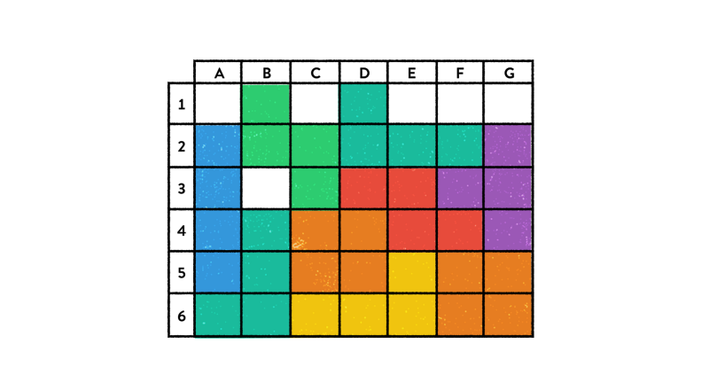
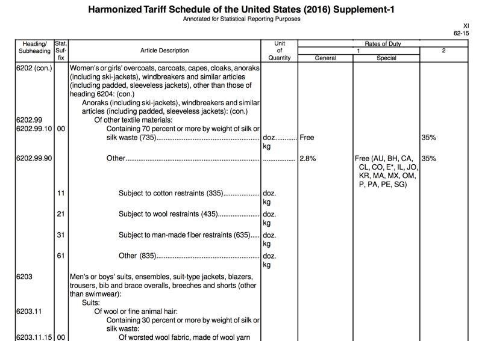
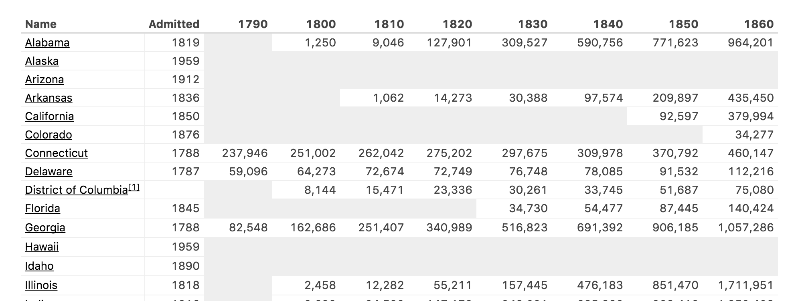
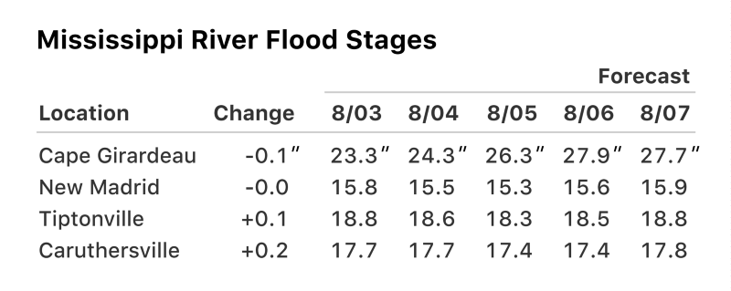
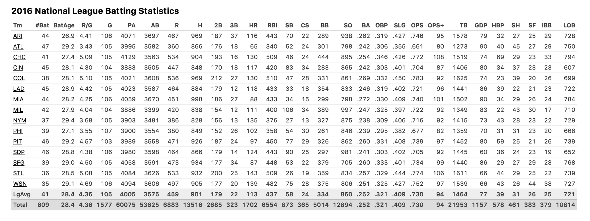

# Создавайте хорошие таблицы

**Бедные таблицы.** Ну что с ними не так?

В начале истории веба таблицы являлись основой отображения информации. Со временем разработчики нашли новые, более модные способы представления данных, и таблицы отошли на второй план. Сегодня таблицы используются гораздо реже, однако по-прежнему собирают и упорядочивают большие объёмы информации, с которыми мы сталкиваемся ежедневно.

Вот пример, который я называю таблицей всех таблиц: *Гармонизированный тариф США*, занимающий более чем 3550 страниц. В нём содержится описание каждого товара, который может быть импортирован в США, включая такие захватывающие позиции, как «Мужские и детские пальто, полупальто, накидки, куртки, анораки (включая лыжные костюмы), ветровки и подобные товары (включая утеплённые жилеты)».

*Так что же такое полупальто?*

Безграмотно спроектированная таблица выглядит уродливо. Дизайн — основа таблицы: когда он сделан правильно, сложные данные легко просматривать и сравнивать. Если дизайн некорректный, информация перестаёт быть понятной.

Давайте посмотрим, как делать правильно.

## Следите за числами

Не все числа одинаковы. Я не имею в виду π (Пи) и ∞ (хотя упоминаю о них на вечеринках), а говорю об отображении цифр, разделяющихся на минускульные или маюскульные, и на пропорциональные или табличные.

*Минускульные и маюскульные*

[Минускульные](http://www.paratype.ru/help/term/terms.asp?code=342) цифры здорово выглядят в предложениях, где они соотносятся с размерами и отступами строчных символов. [Маюскульные](http://www.paratype.ru/help/term/terms.asp?code=596) цифры более однообразны, что соответствует ровной структуре таблицы.

Разница между пропорциональными и табличными цифрами не столь очевидна:

*Пропорциональные и табличные цифры*

Пропорциональные цифры созданы, чтобы передавать оттенок — соответствовать общим размерам и отступам — гарнитуры шрифта. Табличные цифры соразмерны друг с другом, что позволяет выравнивать колонки с числами. Хотя разница на примере одной-двух строк не столь очевидна, использование табличных цифр позволяет легче просматривать большие таблицы и снижать вероятность ошибок прочтения.

### Техническое замечание о табличных маюскульных цифрах

На этапе дизайна стоит убедиться, что используемые цифры вам подходят (табличное и маюскульное выравнивание обычно выключено по умолчанию). Продукты Adobe включают панель «opentype», при помощи которой цифрам задаётся правильная настройка. Чтобы включить соответствующее свойство в CSS, нужно разобраться в [слегка запутанном синтаксисе](https://css-tricks.com/almanac/properties/f/font-feature-settings/). Как бы то ни было, несколько запросов к гуглу наставят вас на путь истинный.

Теперь плохие новости: табличные маюскульные цифры доступны не для всех шрифтовых гарнитур. Гарнитуры, которые их включают, [обычно дороги](https://www.myfonts.com/fonts/fontfont/ff-meta/). Есть несколько исключений: например, прекрасный [Work Sans](https://fonts.google.com/specimen/Work+Sans) — бесплатный шрифт с табличными маюскульными цифрами.

Если трудно найти подходящую шрифтовую гарнитуру, используйте запасной вариант — моноширинные шрифты. Они выглядят более похожими на код, однако всегда подойдут для отображения чисел в таблице. Стоит добавить, что San Francisco, новый системный шрифт по умолчанию у Apple, содержит табличные маюскульные цифры, хорошо отображающиеся при малых размерах.

## Помните о выравнивании

Следуйте 3½ правилам:
1\. **Числовые данные выравниваются по правой стороне.**
2\. **Текстовые данные выравниваются по левой стороне.**
3\. **Заголовки выравниваются так же, как и их данные.**
3½\. **Не используйте выравнивание по центру.**

*Список штатов США по историческому населению — [Wikipedia](https://en.wikipedia.org/wiki/List_of_U.S._states_by_historical_population)*

Числа читаются справа налево — при сравнении чисел мы сначала смотрим на единицы, потом на десятки, сотни и т.д. Это тот же способ, которым люди учат арифметику — начинают справа и двигаются влево, собирая и группируя цифры по ходу прочтения**[1]**. Следовательно, таблицы должны выравнивать числовые данные по правому краю.

Тексты (в русском языке) читаются слева направо. Тексты обычно сравнивают по алфавитному порядку: если две строчки начинаются с одной буквы, сравнивается следующая, и т. д. Попытка быстро пробежаться по тексту, не выровненному по левой стороне, крайне затруднительна. 

Заголовки должны сохранять выравнивание соответствующих им данных. Вертикальные линии таблицы в этом случае будут выглядеть опрятно, а данные — цельно и согласованно. 

При выравнивании по центру линии таблицы кажутся «зазубренными», что затрудняет просмотр содержимого. Это часто заставляет добавлять в таблицу дополнительные разделители и графические элементы.

### Согласующиеся значащие цифры = хорошее выравнивание 

Простой способ сохранить правильное выравнивание таблицы — соблюдать единообразие в написании [значащих цифр](https://ru.wikipedia.org/wiki/%D0%9E%D0%BA%D1%80%D1%83%D0%B3%D0%BB%D0%B5%D0%BD%D0%B8%D0%B5#.D0.AD.D0.BC.D0.BF.D0.B8.D1.80.D0.B8.D1.87.D0.B5.D1.81.D0.BA.D0.B8.D0.B5_.D0.BF.D1.80.D0.B0.D0.B2.D0.B8.D0.BB.D0.B0_.D0.B0.D1.80.D0.B8.D1.84.D0.BC.D0.B5.D1.82.D0.B8.D0.BA.D0.B8_.D1.81_.D0.BE.D0.BA.D1.80.D1.83.D0.B3.D0.BB.D0.B5.D0.BD.D0.B8.D1.8F.D0.BC.D0.B8). Обычно это означает, что внутри каждого столбца у чисел должно быть одинаковое количество знаков после запятой. Значащие цифры — тема для отдельной статьи, так что я оставлю здесь лишь краткий совет: чем меньшим количеством значащих цифр можно обойтись, тем лучше.

## Лаконичные, понятные подписи

Подписи, сопровождающие данные, особо важны. Эти элементы вспомогательного контекста позволяют читать таблицу более широкой аудитории, и при большем количестве различных обстоятельств.

Прогноз уровня воды при наводнении в Mississippi — [NOAA](http://www.weather.gov/lmrfc/obsfcst_mississippi)

### Заглавие

Это звучит как само собой разумеющееся, но краткое и ясное заглавие настолько же важно для таблицы, как и весь остальной дизайн. С хорошим заглавием таблицы становятся мобильны — их можно перенести на множество различных контекстов, на них легко сослаться из внешних источников.

### Единицы измерения

Самая частая подпись, используемая в таблицах — единицы измерения данных. Обычно её повторяют в каждой отдельной ячейке таблицы. Чтобы избежать повторения, достаточно включить подпись в первую строчку каждой колонки.

### Заголовки

Сохраняйте заголовки настолько короткими, насколько это возможно. Дизайн таблицы должен фокусироваться на данных. Длинные надписи в заголовках будут мешать этому, занимая огромную часть визуального пространства.

## Как можно меньше чернил

Когда вы решаете, как стилизовать графические элементы в таблице, всегда следует стараться уменьшить цветовую насыщенность таблицы без потери структуры. Старайтесь использовать как можно меньше «чернил» — т. е. не стилизовать элементы, когда это возможно.

*Статистика бэттинга в Национальной Лиге 2016 — [BaseballReference](http://www.baseball-reference.com/leagues/NL/2016.shtml)*

### Линии

Если вы правильно выровняли данные в таблице, в использовании линий нет смысла. Главное преимущество линий — возможность сократить расстояние между элементами, в то же время отделяя их друг от друга. Даже если вы используете линии, старайтесь сделать их невзрачными, чтобы они не мешались при беглом просмотре.

Наиболее полезны горизонтальные линии. Они позволяют значительно сократить высоту длинных таблиц, ускоряя сравнение большого количества данных или подмечая тенденции их изменения.

Также у меня есть личное мнение по поводу линий: **не используйте разделение на полосы по зебре**. Это плохая практика. Впрочем, соглашаться со мной или нет — решать вам.

### Фоны

Фоны наиболее хороши для подсветки различных областей данных: например, переходов от частных значений к суммам или средним значениям.

Многие элементы можно выделить без использования фонов: подсветку значений, дополнительный контекст к данным, изменения в значениях по сравнению с прошлыми периодами. Воспользуйтесь графическими элементами, например ✻, † (один из моих любимых), или ▵.

В дополнение к этому, таблицы должны быть монохромными. Использование цветов в организационных целях или для добавления дополнительного значения увеличивает вероятность неправильной интерпретации или ошибки, вызывает проблемы у людей с нарушениями зрения.

## Заключение

Таблицы могут быть [скучны](https://medium.com/mission-log/well-designed-interfaces-look-boring-568faa4559e0#.25mtj2gsn), но они являются одним из главных элементов в информационно насыщенных документах, поэтому дизайнеры не должны относиться к ним пренебрежительно. Эффективные, прозрачные, читабельные таблицы значительно облегчат тяжелый процесс восприятия большого количества данных.

### Дальнейшее чтение и материалы для вдохновения

[FiveThirtyEight](http://fivethirtyeight.com/features/the-rise-and-rise-of-nneka-ogwumike/) всегда был отличным источником вдохновения — для отображения числовых данных используется гарнитура [Decima Mono](https://www.myfonts.com/fonts/tipografiaramis/decima-mono/), которая специально разработана для отображения больших наборов данных на малом пространстве.

[Butterick’s Practical Typography](http://practicaltypography.com/) — мой справочник по всем вопросам в типографике. Это тот тип ресурсов, на которые у вас куча ссылок — столько там полезных статей!

Ну и наконец, никакая статья по дизайну данных не будет полной без статьи [Edward Tufte](http://www.edwardtufte.com/bboard/q-and-a-fetch-msg?msg_id=00041I). Его письмо о дизайне просто незаменимо.

---

Если вы хотите узнать о других интересных подходах в арифметике, посмотрите как японские дети используют [Soroban](https://www.youtube.com/watch?v=Px_hvzYS3_Y) или как работает [умножение по решётке](https://www.khanacademy.org/math/arithmetic-home/multiply-divide/place-value-area-models/v/lattice-multiplication).

---

_Оригинал: [Design Better Data Tables](https://medium.com/mission-log/design-better-data-tables-430a30a00d8c), автор: Matthew Ström._

_Перевод: [Андрей Алексеев](https://github.com/aalexeev239/), редактура: Яна Крикливая, Чайка Чурсина._
